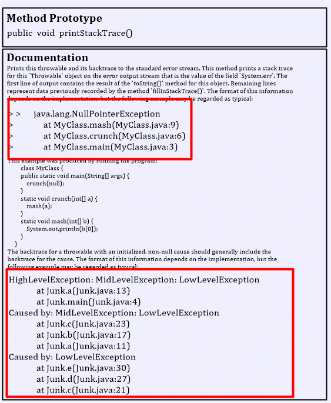

# Excess Structural Information Smell

### What is "Excess Structural Information"

Excess Structural Information (ESI) is a documentation smell that occurs when a documentation unit, such as a method description, contains an overwhelming amount of structural syntax or information. This excessive detail can include numerous class and package names, detailed listings of subclasses, and other structural elements that are not directly relevant to the understanding or usage of the documented entity.

For instance, consider the Javadoc of the `java.lang.Object` class in Java. The documentation for this class lists all of its hundreds of subclasses. While this level of detail might seem thorough, it often proves unnecessary and can overwhelm the reader, making it harder to extract the essential information needed to understand and use the class effectively.

<figure><figcaption>
Example of Excess Structural Information
</figcaption></figure>

Here in this figure, the documentation contains many structural details, highlighted with a red rectangle, that do not contribute to the purpose of understanding and using the underlying method. Such information overload can detract from the documentation's primary goal: to provide clear and concise guidance on using the method effectively.

### Why is "Excess Structural Information" a Problem?

The primary issue with Excess Structural Information is that it can obscure the critical points that developers need to grasp quickly. When documentation is cluttered with too much structural detail, it becomes challenging to discern the core functionality and usage of a method or class. This can lead to several problems:

* **Reduced Readability:** Developers may struggle to find the relevant information amidst the clutter, increasing the time it takes to understand the documentation.
* **Increased Maintenance Burden:** Detailed structural information is prone to becoming outdated as the codebase evolves. This can lead to inconsistencies and inaccuracies in the documentation, further complicating its usefulness.
* **Impeded Learning:** For newcomers, encountering overly detailed documentation can be intimidating and confusing, potentially slowing down the learning process and reducing overall productivity.

